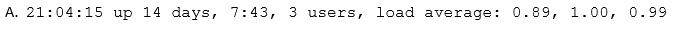
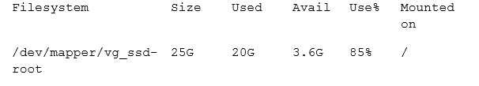
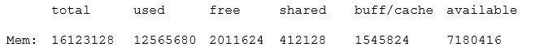

# Linux Essentials

**Reference:** <https://www.examtopics.com/exams/lpi/010-160/>

## Questions

1. Quais são as diferenças entre unidades de disco rígido e discos de SSD? (Escolha duas.)

:white_check_mark: Os discos rígidos têm um motor e peças móveis, os discos de estado sólido não.

:black_large_square: Os discos rígidos podem falhar devido a danos físicos, enquanto os discos de estado sólido não podem falhar.

:black_large_square: Os discos de estado sólido podem armazenar muitas vezes mais dados do que as unidades de disco rígido.

:black_large_square: `/dev/sda` é um dispositivo de disco rígido, enquanto `/dev/ssda` é um disco de estado sólido.

:white_check_mark: Os discos de estado sólido fornecem acesso mais rápido aos dados armazenados do que os discos rígidos.

---

2. O DNS reverso atribui nomes de host a endereços IP. Como o nome do endereço IP 198.51.100.165 é armazenado em um servidor DNS?

:black_large_square: No registro A para 165.100.51.198.ipv4.arpa.

:white_check_mark: No registro PTR para 165.100.51.198.in-addr.arpa.

:black_large_square: No registro RNAME para 198-51-100-165.rev.arpa.

:black_large_square: No registro ARPA para 165.100.51.198.rev.

:black_large_square: No registro REV para arpa.in-addr.198.51.100.165.

> _Um registro de ponteiro DNS (PTR, abreviado) fornece o nome de domínio associado a um endereço IP. Um registro PTR DNS é exatamente o oposto do registro 'A', que fornece o endereço IP associado a um nome de domínio. Os registros PTR DNS são usados ​​em pesquisas reversas de DNS._

---

3. Qual dos seguintes tipos de barramento pode conectar unidades de disco rígido com a placa-mãe?

:black_large_square: O barramento RAM

:black_large_square: O barramento NUMA

:black_large_square: O barramento CPU

:white_check_mark: O barramento SATA

:black_large_square: O barramento Auto

---

4. Os membros de uma equipe já têm experiência usando o Red Hat Enterprise Linux. Para um pequeno projeto de hobby, a equipe quer configurar um servidor Linux sem pagar por uma assinatura. Qual das seguintes distribuições Linux permite que os membros da equipe apliquem o máximo possível de seu conhecimento do Red Hat Enterprise Linux?

:black_large_square: Ubuntu Linux LTS

:black_large_square: Raspbian

:black_large_square: Debian GNU/Linux

:white_check_mark: CentOS

:black_large_square: openSUSE

---

5. Quais informações podem ser exibidas pelo comando `top`?

:black_large_square: Arquivos existentes, ordenados por tamanho.

:white_check_mark: Processos em execução, ordenados por consumo de CPU ou RAM.

:black_large_square: Contas de usuário, ordenadas pelo número de logins.

:black_large_square: Grupos de usuários, ordenados pelo número de membros.

:black_large_square: Contas de usuário, ordenadas pelo número de arquivos.

---

6. Qual dos seguintes comandos pode ser usado para resolver um nome DNS para um endereço IP?

:black_large_square: dnsname

:black_large_square: dns

:black_large_square: query

:white_check_mark: host

:black_large_square: iplookup

> _O comando `host` é um utilitário de pesquisa de DNS , localizando o endereço IP de um nome de domínio. Também realiza pesquisas reversas , localizando o nome de domínio associado a um endereço IP._

---

7. Qual das seguintes saídas vem do comando free?

:black_large_square: 

:black_large_square: 

:black_large_square: 

:black_large_square: 

:white_check_mark: 

---

8. O que é verdade sobre o comando dmesg? (Escolha duas)

:black_large_square: Ele rastreia a execução de um comando e mostra cada etapa que o programa realiza.

:black_large_square: Ele envia mensagens para as linhas de comando de todas as sessões de usuário atuais.

:white_check_mark: Ele exibe o conteúdo do buffer de anel do kernel Linux.

:black_large_square: Ele imediatamente emite todas as novas mensagens escritas no diário do sistema.

:white_check_mark: Ele pode não exibir informações mais antigas porque foram substituídas por informações mais recentes.

---

9. Qual das seguintes saídas pode resultar do comando last?

:black_large_square: 1 ls 2 cat text.txt 3 logout

:black_large_square: A senha do usuário foi alterada pela última vez em Sáb Mar 31 16:38:57 EST 2018

:black_large_square: Último login: Sex Mar 23 10:56:39 2018 de server.example.com

:black_large_square: EXT4-fs (dm-7): sistema de arquivos montado com modo de dados ordenados. Opts: (null)

:white_check_mark: root tty2 Qua Mai 17 21:11 - 21:11 (00:00)

> _O comando `last` é uma ferramenta de linha de comando usada em sistemas operacionais do tipo Unix e Linux para exibir informações sobre as últimas sessões de login dos usuários do sistema._

---

10. Qual é o UID do usuário root?

:black_large_square: 1

:black_large_square: -1

:black_large_square: 255

:black_large_square: 65536

:white_check_mark: 0

---

11. Quais permissões são definidas em um arquivo regular depois que as permissões foram modificadas com o comando chmod 654 file.txt?

:black_large_square: drw-r-xr--

:black_large_square: d-wxr-x--

:black_large_square: -wxr-x--x

:black_large_square: -rwxrw---x

:white_check_mark: -rw-rr-x--

> _O modo octal recebe este nome, pois utilizamos oito números, de 0 à 7, cada um desses números correspondem a uma letra, ou a um conjunto de letras, no modo simbólico:_
>   - _1 → Representa a opção de execução (x) no modo simbólico_
>   - _2 → A opção de escrita (w);_
>   - _4 → A opção de leitura (r)._

---

12. O que é verdade sobre o proprietário de um arquivo?

:white_check_mark: Cada arquivo é de propriedade de exatamente um usuário e um grupo.

:black_large_square: O proprietário de um arquivo sempre tem permissões totais ao acessar o arquivo.

:black_large_square: O usuário que possui um arquivo deve ser um membro do grupo do arquivo.

:black_large_square: Quando um usuário é excluído, todos os arquivos de propriedade do usuário desaparecem.

:black_large_square: O proprietário de um arquivo não pode ser alterado depois que ele é atribuído a um proprietário.

---

13. Quais das seguintes permissões estão definidas no diretório /tmp/?

:white_check_mark: rwxrwxrwt

:black_large_square: ------rwX

:black_large_square: rwSrw-rw-

:black_large_square: rwxrwS---

:black_large_square: r-xr-X--t

> _`t` - Salva a imagem do texto do programa no dispositivo swap, assim ele será carregado mais rapidamente quando executado, também chamado de stick bit._
> _Em diretórios, impede que outros usuários removam arquivos dos quais não são donos. Isto é chamado de colocar o diretório em modo append-only. Um exemplo de diretório que se encaixa perfeitamente nesta condição é o `/tmp`, todos os usuários devem ter acesso para que seus programas possam criar os arquivos temporários lá, mas nenhum pode apagar arquivos dos outros. A permissão especial `t`, pode ser especificada somente no campo outros usuários das permissões de acesso._

---

14. Qual comando adiciona o novo usuário tux e cria o diretório home do usuário com arquivos de configuração padrão?

:black_large_square: defaultuser tux

:white_check_mark: useradd -m tux

:black_large_square: usercreate tux

:black_large_square: useradd -o default tux

:black_large_square: passwd -a tux

> _`-m` cria o diretório home fornecido na opção “-d” com os arquivos e estrutura definidos na configuração de /etc/skel;_

---

15. Quais informações são armazenadas em /etc/passwd? (Escolha três)

:black_large_square: O limite de espaço de armazenamento do usuário

:white_check_mark: O ID numérico do usuário

:white_check_mark: O nome de usuário

:black_large_square: A senha criptografada

:white_check_mark: O shell padrão do usuário

---

16. Qual das seguintes opções tar lida com a compactação? (Escolha duas.)

:black_large_square: -bz

:white_check_mark: -z

:black_large_square: -g

:white_check_mark: -j

:black_large_square: -z2

---

**Reference:** <https://docs.google.com/forms/d/e/1FAIpQLSfXpcMEub7D2q9QZ7m6M_TTi337pGW4NtoecCofO8oGW3JWZw/viewform>

## Questions

17. Qual a frase que melhor explica o projeto GNU?

:black_large_square: GNU é um acrônimo recursivo que significa GNU Não é Unix, ou seja, em nada o sistema operacional GNU se assemelha ao Unix

:white_check_mark: O GNU visa ser um sistema operacional de código aberto que funciona do mesmo modo que o sistema operacional Unix

:black_large_square: O GNU é o kernel do sistema operacional Linux

:black_large_square: O GNU é um sistema operacional em código aberto concorrente do Linux

---

18. O que é uma distribuição Linux? (assinale duas respostas corretas)

:black_large_square: É uma versão do Linux vendida por empresas e por isso, seu código não é aberto.

:white_check_mark: Além de conter o kernel Linux e programas GNU, uma distribuição Linux normalmente agrega outros recursos para tornar sua utilização mais simples.

:white_check_mark: É uma versão do Linux que roda apenas em um determinado tipo de plataforma.

:black_large_square: Além de oferecerem um conjunto completo de aplicativos prontos para uso, as distribuições mais populares podem atualizar e instalar novos programas automaticamente.

---

19. São exemplos de servidores de páginas web em código aberto:

:black_large_square: WebSphere, BlueMix, Azure

:black_large_square: BadBlue, IIS, iPlanet

:white_check_mark: Apache, Nginx e, lighttpd.

---

20. Para que serve o DHCP?

:black_large_square: O DHCP, Direct Hybernate Control Program, é o serviço responsável por fazer o sistema operacional Linux quando a carga da bateria diminui criticamente.

:black_large_square: O DHCP, Directory Home Check Program, é o serviço responsável por alertar quando falta espaço nas pastas de usuário.

:white_check_mark: O DHCP, Dynamic Host Configuration Protocol, é o serviço responsável por automaticamente estabelecer uma conexão TCP/IP assim que um cabo de rede é inserido ou uma rede sem fio é acessada.

:black_large_square: O DHCP, Dashboard for Heavy Control Processes, é um painel de controle para o monitoramento de processos em execução no Linux.

---

21. Se no código aberto não há necessariamente a venda de cópias dos programas compilados, a empresa ou o profissional são remunerados de outras maneiras. Algumas delas são:

:black_large_square: Financiamento externo - Grandes empresas financiam fundações destinadas a desenvolver e produzir projetos de código aberto. Empresas como Google e IBM dependem de programas de código aberto e por isso os financiam.

:black_large_square: Serviços - Profissionais e empresas costumam vender serviços associados ao código aberto, como suporte técnico, treinamento e consultorias. Empresas locais podem oferecer os mesmos serviços de grandes multinacionais, pois os programas não são exclusivos de nenhuma delas. A certificação LPI é um dos instrumentos utilizados por clientes para localizar profissionais qualificados para prestar serviços.

:black_large_square: Assinaturas - Enquanto que o programa é oferecido sem custo, é possível cobrar pela hospedagem e manutenção no servidor. Aplicativos são oferecidos diretamente na Internet e o usuário paga uma taxa para utilizá-lo, o que muitas vezes é mais conveniente do que contratar um servidor e instalar o programa por conta própria.

:white_check_mark: Todas as respostas acima estão corretas.

---

22. Ao utilizar qualquer tipo de comunicação em rede, sempre existe a possibilidade de que a informação transmitida e recebida esteja sendo interceptada. Para mitigar a possibilidade de um interceptador ler as informações transmitidas via web, é importante verificar a utilização do protocolo:

:black_large_square: secweb

:white_check_mark: https

:black_large_square: winss

:black_large_square: selinux

:black_large_square: http

---

23. Podemos dizer, sobre a virtualização, que: (assinale duas respostas corretas)

:white_check_mark: ela é a capacidade de executar simultaneamente mais de um sistema operacional num mesmo computador.

:white_check_mark: ela permite a presença de sistemas operacionais servidores com diferentes finalidades dentro de uma mesma máquina.

:black_large_square: ela é um diferencial importante nos softwares proprietários, já que não é possível a virtualização com softwares livres.

:black_large_square: ela é um diferencial importante nos softwares livres, já que não é possível a virtualização com softwares proprietários.

:black_large_square: ela é uma tecnologia promissora mas que, infelizmente, ainda exige muitos recursos para ser implementada na prática.

---

24. Quando você digita, na linha de comando do Linux (bash) o seguinte comando: echo -e "Linux&nEssentials", qual é o resultado?

:black_large_square: "Linux&nEssentials"

:white_check_mark: Linux&nEssentials

:black_large_square: Linux e, na linha seguinte, Essentials

:black_large_square: Linux Essentials

:black_large_square: Uma linha em branco

:black_large_square: O resultado é uma mensagem de erro

---

25. Qual é o possível resultado do comando: ls /etc/host?

:black_large_square: /etc/host.conf  /etc/hostname  /etc/hosts  /etc/hosts.allow  /etc/hosts.deny

:white_check_mark: ls: não é possível acessar '/etc/host': Arquivo ou diretório não encontrado

:black_large_square: /etc/hosts

:black_large_square: -rw-r--r-- 1 root root 419 Jan 21 20:15 /etc/hosts

:black_large_square: /etc/hosts: ASCII text

---

26. Como você pode obter mais informações sobre os comandos e programas que podem ser executados a partir do bash?

:black_large_square: Posso usar [comando --help] (digitando no terminal o que está entre as chaves) para obter uma ajuda rápida sobre as opções do [comando]

:black_large_square: [man comando], (digitando no terminal o que está entre as chaves) para obter o manual do [comando]

:black_large_square: [info comando], (digitando no terminal o que está entre as chaves) para ler um tutorial sobre o uso do [comando]

:white_check_mark: Todas as alternativas anteriores estão corretas.

---

27. Podemos dizer, sobre caminhos relativos para pastas (diretórios) que:

:black_large_square: /root é a pasta raiz do sistema, . é a pasta onde estamos, ... representa duas pastas superiores à que estamos e /home é a pasta correspondente ao usuário acessando o sistema nesse 
momento

:black_large_square: /root é a pasta do super usuário, .. é a pasta onde estamos, ... representa a pasta /etc e /home/user é a pasta correspondente ao usuário acessando o sistema nesse momento

:black_large_square: / é a pasta raiz, . é a pasta onde estamos, .. é a pasta imediatamente superior à que estamos e ~ é a pasta correspondente ao usuário acessando o sistema nesse momento

:black_large_square: * é a pasta raiz do sistema, ? é a pasta onde estamos nesse momento, /home é a pasta do usuário padrão

Todas as alternativas estão corretas

:white_check_mark: Nenhuma alternativa está correta

---

28. Qual o resultado possível para esse comando: find /usr/local/bin/ -name search

:black_large_square: Google

:black_large_square: Error 404

:white_check_mark: /usr/local/bin/search

:black_large_square: name

:black_large_square: /home/name

---

29. O comando cp é utilizado para copiar arquivos. Suas opções principais são (assinale três respostas corretas):

:white_check_mark: -r: Copia recursivamente o conteúdo do diretório de origem.

:black_large_square:-H: Não copia nada, apenas mostra uma ajuda para o comando.

:white_check_mark: -p: Copia também os atributos do arquivo original.

:black_large_square:-T: Copia os arquivos preservando os atributos de tempo de criação.

:white_check_mark: -i: Modo interativo. Pergunta antes de sobrescrever um arquivo.

:black_large_square: -X: copia os arquivos removendo os atributos de execução.

---

30. Qual o comando usado para trocar nomes de arquivos no bash?

:black_large_square: changename

:black_large_square: ln

:white_check_mark: mv

:black_large_square: ls -rename

:black_large_square: move

---

31. Em qual pasta é possível encontrar mais informações sobre comandos e aplicativos do Linux?

:black_large_square: Google

:black_large_square: /root/documents

:black_large_square: /usr/documents

:black_large_square: /distro/manuals

:white_check_mark: /usr/share/doc

---

32.  É correto dizer sobre o comando: tar cvf etc.tar /etc (assinale duas alternativas corretas)

:black_large_square: em "cvf", a chave "v" instrui o comando tar a verificar a chave MD5 de cada arquivo que está sendo extraído.

:white_check_mark: Como resultado da execução desse comando, todo o conteúdo da pasta /etc será agrupado em um arquivo chamado etc.tar

:black_large_square: Como resultado da execução desse comando, os arquivos contidos em etc.tar serão extraídos para a pasta /etc.

:white_check_mark: em "cvf", a chave "v" (verbose) instrui o comando tar a exibir o nome de cada um dos arquivos que está anexando ao arquivo etc.tar.

:black_large_square: Este comando retornará um erro.

---

33. Das seguintes opções de comandos, qual a que irá compactar a pasta /home solicitando uma senha necessária para a sua descompactação?

:white_check_mark: tar cpf homes.tar /home

:black_large_square: zip -e -r homes.zip /home

:black_large_square: bzip2 -e -R homes.bz2 /home

:black_large_square: gzip -pr homes.gz /home

:black_large_square: compress -encrypt homes.cpr /home

---

34. Qual a sintaxe correta do comando find para que eu possa encontrar links simbólicos dentro da pasta /home/user?

:black_large_square: find -type l /home/user

:black_large_square: find -type sl /home/user

:white_check_mark: find /home/user -type l

:black_large_square: find /home/user -type sl

:black_large_square: find -symlink /home/user

---

35. Qual das opções a seguir me permite saber o caminho completo, permissões e tamanho de cada arquivo criado há menos de 24 horas na pasta /home/user?

:black_large_square: ls -lt <24h /home/user

:black_large_square: dir -ctime -1 /home/user

:white_check_mark: find /home/user -ctime -1 | xargs ls -lah

:black_large_square: ls -ctime -1 /home/user

:black_large_square: locate -ctime -1 /home/user

---

36. Se desejo saber qual o modelo da CPU usada em meu computador, qual opção me dará essa resposta?

:black_large_square: hostname

:black_large_square: uname -a

:black_large_square: procinfo

:black_large_square: cpuin

:white_check_mark: cat /proc/cpuinfo | grep "model name" | uniq

---

37. Uma linha do arquivo /etc/passwd é a seguinte: "games:x:5:60:games:/usr/games:/usr/sbin/nologin". Como posso extrair, desse arquivo, apenas as informações relativas ao nome do usuário e sua pasta de trabalho?

:white_check_mark: cut -d ":" -f 1,6 /etc/passwd

:black_large_square: cat /etc/passwd -f user,pwd

:black_large_square: egrep /etc/passwd -f [1|6]

:black_large_square: awk -f ":" [1,6] /etc/passwd

:black_large_square: sed /etc/passwd -d":"[1,6]

---

38. Quais as três afirmativas verdadeiras sobre o comando paste?

:black_large_square: Ele concatena linhas de arquivos, na forma de colunas (uma linha de cada arquivo ao lado da outra, em sequencia), caso não seja usada nenhuma chave.

:white_check_mark: Com a opção -s, o paste colocará as linhas dos arquivos uma abaixo da outra, em vez de ao lado.

:white_check_mark: O comando paste desfaz o que o comando cut fez.

:white_check_mark: O comando paste, usado com apenas um arquivo, funciona como o comando cat.

:black_large_square: O comando paste pode ser usado apenas dentro de scripts, nunca na linha de comando.

> _comando `paste`

---

39. Para que serve a primeira linha de um script, iniciada pelos caracteres #!

:black_large_square: É um comentário dizendo para que servirá o script.

:black_large_square: É a linha a partir da qual todas as variáveis são declaradas

:white_check_mark: #! indica qual será o interpretador dos comandos nas linhas seguintes.

:black_large_square: É a linha que indica que todos os comandos serão interpretados pela linguagem Perl.

---

40. Qual é o resultado do comando: echo $?

:black_large_square: não é possível executar 'echo $?'

:black_large_square: $?

:black_large_square: O programa '$?' não está instalado no momento. Você pode instalá-lo digitando: sudo apt install echo

:white_check_mark: Um número inteiro, sendo 0 no caso do comando anterior ter sido executado sem erros

:black_large_square: 0, pois ? é sempre uma variável de conteúdo nulo

> váriavel ?

---

41. Considere a imagem abaixo, representando um script em shell. Qual será o resultado de sua execução?

:black_large_square: 1|2|3|4|5

:white_check_mark: Número 1 encontrado na lista!

:black_large_square: Syntax error on line 2, variable not declared

:black_large_square: O script teria funcionado se, no lugar de "esac" fosse usado "endcase"

---

42. Supondo que eu tenha um script chamado meuscript.sh, qual o comando que o torna executável?

:black_large_square: chmod +x meuscript.sh

:black_large_square: chmod 700 meuscript.sh

:black_large_square: chmod u+x meuscript.sh

:black_large_square: chmod 777 meuscript.sh

:white_check_mark: Todas as respostas, ainda que algumas delas não sejam recomendáveis por questões de segurança.

:black_large_square: Nenhuma das respostas. É preciso usar um sticky bit para isso.

---

43. O que podemos dizer que é verdade quanto às vantagens do Linux perante o MS Windows ou o MacOS?

:black_large_square: Liberdade e versatilidade. Preservadas as condições definidas na licença de cada componente, o Linux pode ser utilizado como melhor convier ao usuário.
Aprendizado. Usuários interessados no funcionamento do sistema operacional ou em aprender a programar encontram imensas fontes de informação num sistema Linux, tanto na forma de código fonte quanto de documentação.

:black_large_square: Programas. Um usuário de Linux tem a sua disposição uma grande variedade de programas a partir do instalador de pacotes da distribuição. Usuários do OS X e Windows já possuem instaladores semelhantes, mas no Linux os instaladores estão consolidados há mais tempo e a instalação de programas “por fora” é algo raro e não recomendado. Essa característica assegura a compatibilidade e a segurança do sistema operacional.

:black_large_square: Compatibilidade. Enquanto que com o OS X não é usual a instalação em equipamentos diferentes e com o Windows será necessário instalar diversos drivers de dispositivo à parte, uma distribuição Linux recém instalada está pronta para uso e raramente necessita de ajustes.

:white_check_mark: Todas as respostas acima são verdadeiras.

:black_large_square: Nenhuma das respostas acima é verdadeira.

---

44. O que você pode dizer que são desvantagens do Linux (assinale duas respostas corretas)?

:white_check_mark: Ainda que o Linux possa ser a opção ideal para servidores, ele jamais será a opção para dispositivos móveis.

:black_large_square: inda há falta de padronização. Existem diferenças significativas entre as distribuições. A execução de uma tarefa em uma distribuição não será necessariamente igual em outra distribuição.

:white_check_mark: O código aberto do Linux o torna muito mais propenso a ataques por crackers.

:black_large_square: O código aberto do Linux impede que ele seja usado em aplicações de missão crítica.

:black_large_square: Suporte. Alguns fabricantes de dispositivos e programas não fornecem suporte para Linux, obrigando o usuário a manter um Windows ou OS X exclusivamente para esses casos.

---

45. Qual dos comandos fornece informações sobre os dispositivos usb conectados em meu sistema Linux?

:black_large_square: cat /etc/usbtab

:white_check_mark: lsusb

:black_large_square: cat /proc/cpuinfo | grep usb

:black_large_square: modprobe -m usb

:black_large_square: info usb

---

46. No Linux, todo dispositivo de armazenamento encontrado é identificado por um arquivo dentro do diretório /dev/. É correto dizer que:

:black_large_square: Dispositivos não encontrados pelo sistema, por qualquer que seja o motivo, serão colocados no diretório /de/null.

:black_large_square: Os dispositivos de armazenamento não são encontrados automaticamente e devem ser incluídos no arquivo /dev/fstab para serem encontrados.

:white_check_mark: Discos rígidos, mesmo os externos, são nomeados /dev/sda, /dev/sdb, /dev/sdc, etc, na ordem correspondente à que são identificados pelo sistema.

:black_large_square: Apenas discos já instalados no momento em que o sistema é inicializado estarão em /dev. Os demais são encontrados em /opt.

---

47. 