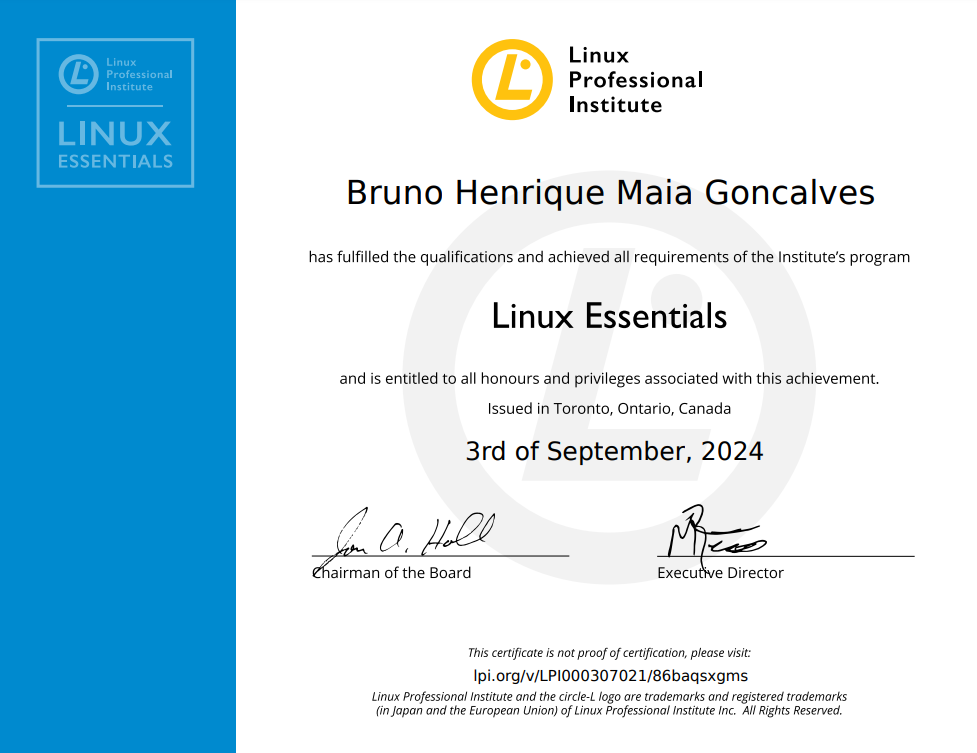

# LPI-Essentials

A LinuxTips fez uma parceria com a LPI e disponibilizou desconto para a prova da Linux Essentials com isso também liberaram em sua plataforma um curso preparatório para essa prova.

## Status

- :white_check_mark: Concluído curso liberado pela Linuxtips :tada:
- :white_check_mark: Certificado emitido :tada:
- :white_check_mark: Simulados :tada: 
- :white_check_mark: Prova agendada :tada:
- :white_check_mark: Certificado!! :tada: :tada: :tada:

https://cs.lpi.org/caf/Xamman/certification/verify/LPI000307021/86baqsxgms